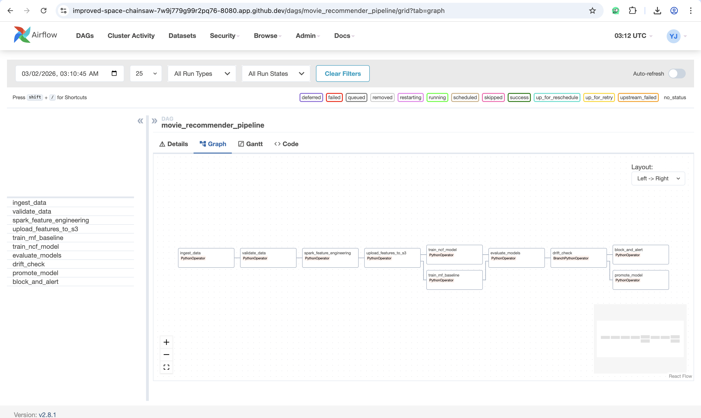

# Movie Recommender Pipeline

Production-grade movie recommendation system with PySpark feature engineering, TensorFlow Neural Collaborative Filtering, Apache Airflow orchestration, MLflow experiment tracking, and PSI drift monitoring.

**Built on MovieLens 32M** — 32 million ratings, 200K users, 87K movies.



---

## Key Results

| Model | HR@5 | HR@10 | HR@20 | NDCG@10 | AUC | Coverage |
|---|---|---|---|---|---|---|
| Matrix Factorization (baseline) | — | — | — | — | — | — |
| Neural Collaborative Filtering | — | — | — | — | — | — |

> *Metrics will be populated after full training on Colab T4 GPU. Evaluation uses 1 positive + 99 negative candidates per user (RecSys standard protocol).*

---

## Architecture

```
╔══════════════════════════════════════════════════════════════════════════════════╗
║                         APACHE AIRFLOW (Docker Compose)                         ║
║   ┌──────┐  ┌──────────┐  ┌──────────┐  ┌─────────┐  ┌─────────┐  ┌────────┐  ║
║   │Ingest│→ │Spark FE  │→ │Upload S3 │→ │Train TF │→ │Evaluate │→ │Promote │  ║
║   │Data  │  │Pipeline  │  │Features  │  │NCF Model│  │+Drift   │  │or Block│  ║
║   └──┬───┘  └────┬─────┘  └────┬─────┘  └────┬────┘  └────┬────┘  └───┬────┘  ║
╚══════╪══════════╪═══════════╪═══════════════╪══════════════╪═══════════╪═══════╝
       │          │           │               │              │           │
       ▼          ▼           ▼               ▼              ▼           ▼
  ┌─────────┐ ┌──────────┐ ┌──────────┐ ┌──────────────┐ ┌────────┐ ┌────────┐
  │MovieLens│ │ PySpark  │ │  AWS S3  │ │ TensorFlow   │ │  PSI   │ │ MLflow │
  │ 32M CSV │ │ 3.5+     │ │Data Lake │ │ NCF + MF     │ │ Drift  │ │Registry│
  │ 239 MB  │ │ Features │ │ 4 tiers  │ │ 2 models     │ │Monitor │ │  v1→v2 │
  └─────────┘ └──────────┘ └──────────┘ └──────────────┘ └────────┘ └────────┘
```

---

## Components

| Component | Technology | What It Does |
|---|---|---|
| **Feature Engineering** | PySpark 3.5 | 8 user features + 7 item features on 32M ratings, temporal per-user split, Parquet output |
| **Baseline Model** | TF Matrix Factorization | Dot-product with bias terms — simple but strong baseline |
| **Main Model** | TF Neural Collaborative Filtering | Two-tower GMF + MLP architecture (He et al., 2017) |
| **Data Lake** | AWS S3 | 4-tier bucket: raw → features → models → mlflow-artifacts |
| **Experiment Tracking** | MLflow 2.18 | Parameter/metric logging, model registry with Production stage |
| **Pipeline Orchestration** | Apache Airflow 2.8 | 10-task DAG with parallel training and drift-gated promotion |
| **Drift Monitoring** | PSI | 5 features monitored; PSI > 0.2 blocks model promotion |
| **Testing** | pytest | 34 unit tests across features, models, and pipeline utilities |

---

## Quick Start

### Prerequisites

- Python 3.11+
- Docker & Docker Compose
- Java 17 (for Spark)
- AWS account with S3 bucket (optional — pipeline runs locally without it)

### 1. Clone and Install

```bash
git clone https://github.com/yashraj10/movie-recommender-pipeline.git
cd movie-recommender-pipeline
pip install -r requirements.txt
```

### 2. Download Dataset

```bash
wget https://files.grouplens.org/datasets/movielens/ml-32m.zip
unzip ml-32m.zip -d data/
```

### 3. Run Feature Engineering (PySpark)

```bash
python -m spark.feature_engineering
```

This processes 32M ratings into user/item features with temporal train/val/test split. Output: `data/features/` (Parquet).

### 4. Train Models (CPU quick test)

```bash
python -m model.train
```

For full training on 32M interactions, use Google Colab with T4 GPU.

### 5. Run Tests

```bash
python -m pytest tests/ -v
```

### 6. Start Airflow + MLflow

```bash
docker compose up -d

# Airflow UI: http://localhost:8080 (admin/admin)
# MLflow UI:  http://localhost:5000
```

### 7. Configure AWS (Optional)

```bash
cp .env.example .env
# Edit .env with your AWS credentials
```

---

## Design Decisions

### Why Temporal Split (Not Random)?

Random train/test split leaks future information — the model sees ratings from 2023 during training and gets tested on 2018. **Temporal split is realistic**: for each user, the earliest 80% of ratings train, next 10% validate, last 10% test. The model never sees future behavior during training. This is how production recommendation systems work.

### Why Two-Tower NCF?

The GMF tower learns linear (multiplicative) user-item interactions through element-wise product. The MLP tower learns non-linear patterns through a 3-layer network (128 → 64 → 32). Separate embedding spaces let each tower specialize. The fusion layer combines both representations for the final prediction.

### Why Spark for 32M Rows?

Pandas can load 32M rows, but struggles with per-user window functions for temporal splitting and genre explosion joins. More importantly, Spark pipelines scale horizontally — replace `local[*]` with a Databricks or EMR cluster for production data volumes.

### Why Implicit Feedback?

Predicting ratings (explicit) doesn't reflect real recommendation — you want to predict **whether a user will engage**, not what score they'll give. Implicit feedback with 4:1 negative sampling (He et al., 2017) mirrors production systems at Netflix and Spotify.

### Why PSI Drift Monitoring?

If user behavior shifts (rating inflation, new genre popularity), the model's training data no longer represents reality. PSI detects distribution shifts across 5 key features. PSI > 0.2 blocks automatic promotion in the Airflow DAG, keeping the current Production model safe.

---

## Airflow DAG

10-task pipeline with parallel training and drift-gated promotion:

```
ingest_data → validate_data → spark_feature_engineering → upload_features_to_s3
    → [train_mf_baseline, train_ncf_model] (parallel)
        → evaluate_models → drift_check
            → promote_model (if PSI < 0.2)
            → block_and_alert (if PSI ≥ 0.2)
```

The `drift_check` task is a `BranchPythonOperator` — it dynamically routes the pipeline based on PSI results.

---

## Project Structure

```
movie-recommender-pipeline/
├── README.md
├── docker-compose.yml              ← Airflow 2.8 + MLflow services
├── requirements.txt
├── .env.example                    ← AWS credentials template
├── .gitignore
│
├── spark/
│   ├── config.py                   ← SparkSession builder (3g driver, Kryo, snappy)
│   ├── schemas.py                  ← StructType definitions for all tables
│   └── feature_engineering.py      ← Full PySpark pipeline (58 min on 32M rows)
│
├── model/
│   ├── matrix_factorization.py     ← TF MF baseline (dot product + bias)
│   ├── ncf.py                      ← TF NCF two-tower (GMF + MLP)
│   ├── data_loader.py              ← Parquet → negative sampling → TF Dataset
│   ├── train.py                    ← Training loop (early stopping, LR scheduling)
│   └── evaluate.py                 ← HR@K, NDCG@K, Coverage metrics
│
├── pipeline/
│   ├── s3_utils.py                 ← AWS S3 upload/download with manifests
│   ├── mlflow_tracking.py          ← Experiment logging + model registry
│   └── drift_monitor.py            ← PSI drift detection (5 features, threshold=0.2)
│
├── airflow/
│   └── dags/
│       └── recommender_pipeline.py ← 10-task DAG with branching
│
├── tests/
│   ├── conftest.py                 ← Shared fixtures
│   ├── test_features.py            ← 8 Spark feature tests
│   ├── test_model.py               ← 11 TF model tests
│   └── test_pipeline.py            ← 15 pipeline utility tests
│
├── docs/
│   ├── architecture.md
│   └── screenshots/
│       ├── airflow_dag.png
│       └── airflow_dag_graph.png
│
└── data/                           ← .gitignore'd
    ├── ml-32m/                     ← Raw MovieLens 32M CSVs
    └── features/                   ← Spark Parquet output
```

---

## Feature Engineering Details

### User Features (8)

| Feature | Description |
|---|---|
| user_avg_rating | Mean rating across all movies |
| user_rating_count | Total number of ratings |
| user_rating_stddev | Rating variance (consistency) |
| user_active_days | Days between first and last rating |
| user_genre_diversity | Count of distinct genres rated |
| user_avg_timestamp | Mean timestamp (recency proxy) |
| user_positive_ratio | Fraction of ratings ≥ 4.0 |

### Item Features (7)

| Feature | Description |
|---|---|
| item_avg_rating | Mean rating received |
| item_rating_count | Total ratings received |
| item_rating_stddev | Rating variance |
| item_genre_count | Number of genres |
| item_recency_score | Exponential decay from last rating |
| item_popularity_rank | Dense rank by rating count |

### Pipeline Stats

- **Input:** 32,000,263 ratings
- **After cold-start filter:** 200,948 users → 200,948, 87,585 movies → 43,884
- **Output:** 25.4M train / 3.2M val / 3.3M test interactions
- **Runtime:** 58 minutes (4-core, 16GB Codespaces)

---

## Model Architecture

### Neural Collaborative Filtering (NCF)

```
GMF Tower:                           MLP Tower:
User ID → Embed(64) ─┐              User ID → Embed(64) ─┐
                      ├→ Hadamard                          ├→ Concat(128)
Item ID → Embed(64) ─┘              Item ID → Embed(64) ─┘
                                            │
                                     Dense(128) + BN + Dropout(0.2)
                                     Dense(64)  + BN + Dropout(0.2)
                                     Dense(32)  + BN + Dropout(0.2)
                                            │
        GMF output(64) ──────── Concat ──── MLP output(32)
                                  │
                           Dense(1, sigmoid)
                                  │
                           P(interaction)
```

- **Parameters:** ~25.6M (GMF 12.8M + MLP 12.8M + fusion 27K)
- **Loss:** Binary Cross-Entropy (implicit feedback)
- **Optimizer:** Adam (lr=0.001, with ReduceLROnPlateau)
- **Negative sampling:** 4:1 ratio per positive interaction

---

## Testing

34 tests across 3 test files, all passing:

```
tests/test_features.py   —  8 tests (Spark: cold start, temporal split, ID remap, features)
tests/test_model.py      — 11 tests (TF: output shape/range, save/load, negative sampling)
tests/test_pipeline.py   — 15 tests (PSI drift, MLflow promotion logic, S3 config)
```

Key tests:
- **Temporal leakage detection:** Verifies max(train_timestamp) < min(val_timestamp) per user
- **Negative sample integrity:** No overlap between positive interactions and negative samples
- **Drift simulation:** PSI correctly blocks promotion when distributions shift by +1.0σ

---

## Known Limitations

- **No real-time serving API** — this is a batch pipeline. Real-time serving is covered in my ICU Census project (FastAPI + GCP Cloud Run)
- **No content-based features** — pure collaborative filtering. Hybrid with genre/tag embeddings is a documented next step
- **Single-node Spark** — demonstrates PySpark proficiency. Replace `local[*]` with EMR/Databricks for horizontal scaling
- **SequentialExecutor in Airflow** — SQLite backend requires this. Swap to PostgreSQL + LocalExecutor for production

---

## Future Extensions

1. **Hybrid model** — add content-based tower using movie genre and tag embeddings for cold-start items
2. **Online A/B testing** — interleaving framework to compare models with live user traffic
3. **Real-time scoring** — FastAPI endpoint with Redis caching for top-K recommendations per user
4. **Distributed training** — `tf.distribute.MirroredStrategy` for multi-GPU training on larger datasets

---

## Technologies

PySpark • Apache Spark • Apache Airflow • TensorFlow • Keras • Recommendation Systems • Collaborative Filtering • Neural Collaborative Filtering • Matrix Factorization • Negative Sampling • Implicit Feedback • AWS S3 • MLflow • Model Registry • Pipeline Orchestration • Batch Processing • ETL • Feature Engineering • Data Lake • Model Governance • Drift Monitoring • Docker • Docker Compose • pytest