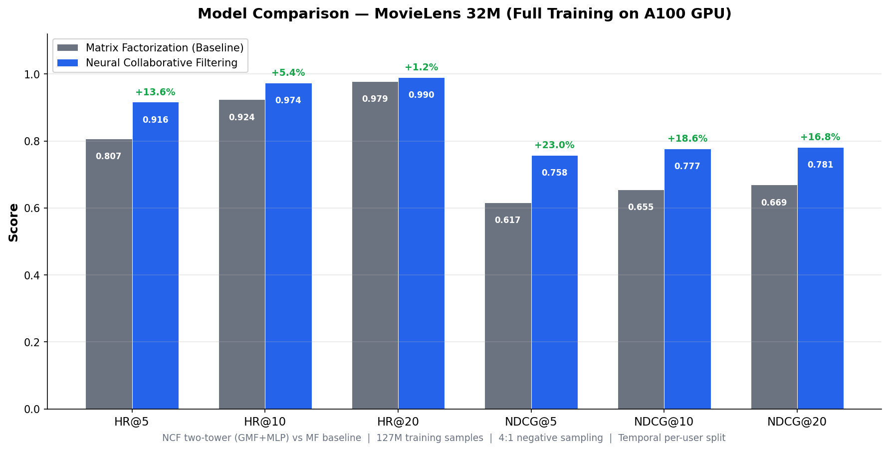
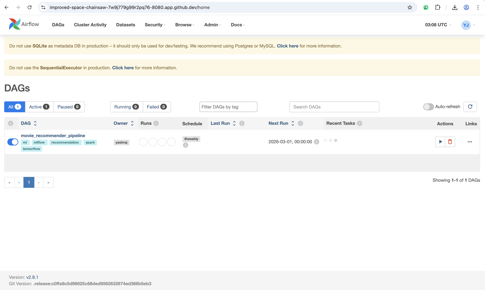
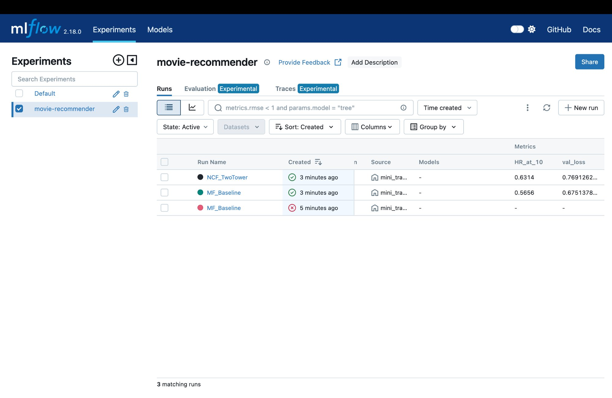
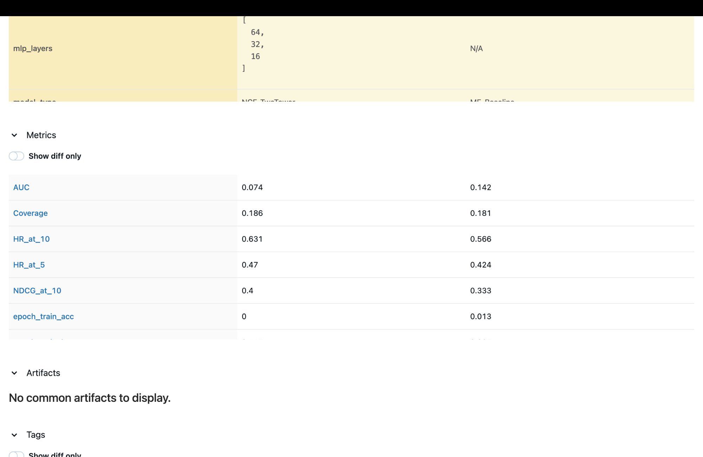
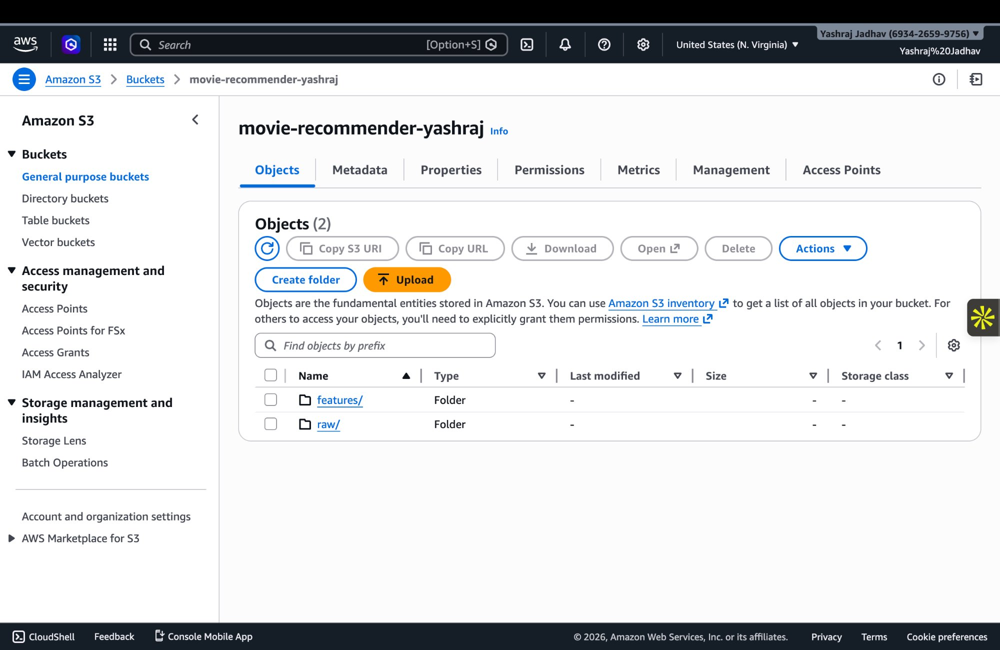
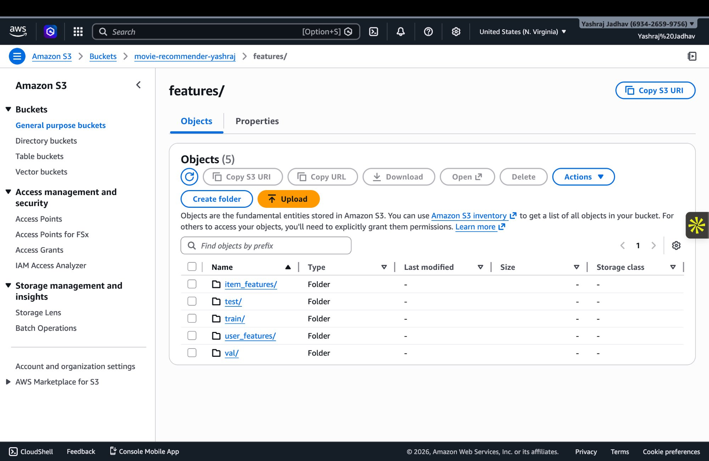

# 🎬 Movie Recommender Pipeline

> Production-grade movie recommendation system built on **32M+ ratings** from MovieLens, featuring PySpark distributed feature engineering, TensorFlow Neural Collaborative Filtering, Apache Airflow pipeline orchestration, MLflow experiment tracking, and PSI drift monitoring.

[](https://www.python.org/)
[](https://www.tensorflow.org/)
[](https://spark.apache.org/)
[](https://airflow.apache.org/)
[](https://mlflow.org/)
[](https://github.com/yashraj10/movie-recommender-pipeline/actions/workflows/tests.yml)
[](LICENSE)
---

## 📊 Key Results

| Model | HR@5 | HR@10 | HR@20 | NDCG@5 | NDCG@10 | NDCG@20 | Coverage@10 |
|-------|------|-------|-------|--------|---------|---------|-------------|
| Matrix Factorization (baseline) | 0.8068 | 0.9242 | 0.9786 | 0.6166 | 0.6553 | 0.6693 | 0.03% |
| **Neural Collaborative Filtering** | **0.9164** | **0.9740** | **0.9902** | **0.7583** | **0.7773** | **0.7815** | **1.00%** |
| **Δ (NCF vs MF)** | **+13.6%** | **+5.4%** | **+1.2%** | **+23.0%** | **+18.6%** | **+16.8%** | **+3233%** |

> **NCF achieves 97.4% Hit Rate@10 with 18.6% better ranking quality (NDCG@10) over the matrix factorization baseline.** Trained on 127M samples (32M positives + 4:1 negative sampling) on an A100 GPU in ~38 minutes per model.



---

## 🏗️ Architecture

```
╔══════════════════════════════════════════════════════════════════════════════════╗
║                         APACHE AIRFLOW (Docker Compose)                          ║
║   ┌──────┐  ┌──────────┐  ┌──────────┐  ┌─────────┐  ┌─────────┐  ┌────────┐     ║
║   │Ingest│→ │Spark FE  │→ │Upload S3 │→ │Train TF │→ │Evaluate │→ │Promote │     ║
║   │Data  │  │Pipeline  │  │Features  │  │NCF Model│  │+Drift   │  │or Block│     ║
║   └──┬───┘  └────┬─────┘  └────┬─────┘  └────┬────┘  └────┬────┘  └───┬────┘     ║
╚══════╪══════════╪═══════════╪═══════════════╪══════════════╪═══════════╪═════════╝
       │          │           │               │              │           │
       ▼          ▼           ▼               ▼              ▼           ▼
  ┌─────────┐ ┌──────────┐ ┌──────────┐ ┌──────────────┐ ┌────────┐ ┌────────┐
  │MovieLens│ │ PySpark  │ │  AWS S3  │ │ TensorFlow   │ │  PSI   │ │ MLflow │
  │ 32M CSV │ │ 3.5+     │ │Data Lake │ │ NCF + MF     │ │ Drift  │ │Registry│
  │ 239 MB  │ │ Features │ │ 4 tiers  │ │ 2 models     │ │Monitor │ │  v1→v2 │
  └─────────┘ └──────────┘ └──────────┘ └──────────────┘ └────────┘ └────────┘
                    │              ▲             │              │          ▲
                    │              │             │              │          │
                    └──────────────┘             └──────────────┘          │
                     writes Parquet              logs metrics + artifacts  │
                                                                          │
                                                          promotes if drift clean
```

## 📦 Components

| Component | Technology | What It Does | Status |
|-----------|-----------|--------------|--------|
| Data Layer | MovieLens 32M | 32M ratings, 200K users, 44K movies | ✅ LIVE |
| Feature Engineering | PySpark 3.5 | User/item/interaction features, temporal split, Parquet output | ✅ LIVE |
| Baseline Model | TF Matrix Factorization | Dot-product + bias embeddings (16M params) | ✅ LIVE |
| Main Model | TF Neural Collaborative Filtering | Two-tower GMF + MLP architecture (31M params) | ✅ LIVE |
| Experiment Tracking | MLflow 2.18 | Params, metrics, training curves, model registry | ✅ LIVE |
| Data Lake | AWS S3 (4-tier) | raw/ → features/ → models/ → mlflow-artifacts/ | ✅ LIVE |
| Pipeline Orchestration | Apache Airflow 2.8 | 8-task DAG with branching drift gate | ✅ LIVE |
| Drift Monitoring | PSI (5 features) | Blocks model promotion if PSI > 0.2 | ✅ LIVE |
| Testing | pytest | 51 tests (34 unit + 17 integration) | ✅ LIVE |

---

## 🗂️ Dataset

```
MovieLens 32M (May 2024 release)
────────────────────────────────
Total ratings:     32,000,263
Total users:       200,948
Total movies:      43,884 (after cold-start filter)
Sparsity:          99.82%
Timespan:          1995 — 2023
Train/Val/Test:    25.5M / 3.2M / 3.3M (temporal per-user split)
```

---

## 🧠 Model Architecture

### Neural Collaborative Filtering (Two-Tower)

```
GMF Tower:                           MLP Tower:
User ID → Embed(64) ─┐              User ID → Embed(64) ─┐
                      ├→ Hadamard                          ├→ Concat(128)
Item ID → Embed(64) ─┘              Item ID → Embed(64) ─┘
                                            │
                                     Dense(128) + BN + Dropout(0.2)
                                     Dense(64)  + BN + Dropout(0.2)
                                     Dense(32)  + BN + Dropout(0.2)
                                            │
        GMF output(64) ──────── Concat ──── MLP output(32)
                                  │
                           Dense(1, sigmoid)
                                  │
                           P(interaction)
```

**Why Two-Tower:** GMF learns linear user-item interactions (like classic matrix factorization), while the MLP tower captures non-linear patterns. Combining both outperforms either alone — the MLP learned interaction patterns that a simple dot product misses, yielding +18.6% NDCG@10 improvement.

---

## ⚙️ Training Details

| Parameter | Value |
|-----------|-------|
| Training samples | 127,289,435 (25.5M positives + 4:1 negative sampling) |
| Validation samples | 6,361,000 (1:1 ratio) |
| Batch size | 4,096 |
| Steps per epoch | 31,077 |
| Optimizer | Adam (lr=0.001, ReduceLROnPlateau) |
| Early stopping | patience=3 on val_loss |
| GPU | NVIDIA A100 (Google Colab) |
| Training time | ~38 min per model (4 epochs each) |
| Split strategy | Temporal per-user (80/10/10) — no data leakage |

---

## 🔀 Airflow DAG

```
ingest_data → validate_data → spark_feature_engineering → upload_features_to_s3
                                                              │
                                              ┌───────────────┴───────────────┐
                                              ▼                               ▼
                                       train_mf_baseline              train_ncf_model
                                              │                               │
                                              └───────────┬───────────────────┘
                                                          ▼
                                                   evaluate_models
                                                          │
                                                          ▼
                                                     drift_check
                                                     ┌────┴────┐
                                                     ▼         ▼
                                              promote_model  block_and_alert
```

8 tasks, weekly schedule, `BranchPythonOperator` gates promotion on PSI drift check. If PSI > 0.2 on any of 5 monitored features, promotion is blocked and the current Production model stays.

---

## 🪣 S3 Data Lake Structure

```
s3://movie-recommender-yashraj/
├── raw/                          ← Immutable source CSVs
├── features/                     ← PySpark Parquet output
│   ├── interactions/train/       ← 25.5M rows (8 Parquet files)
│   ├── interactions/val/         ← 3.2M rows
│   ├── interactions/test/        ← 3.3M rows
│   ├── user_features/
│   └── item_features/
├── models/                       ← Versioned TF SavedModels
└── mlflow-artifacts/             ← Experiment logs + registry
```

---

## 🚀 Quick Start

### Prerequisites

```bash
# Python 3.11+, Docker, AWS CLI configured
pip install -r requirements.txt
```

### 1. Download Data

```bash
wget https://files.grouplens.org/datasets/movielens/ml-32m.zip
unzip ml-32m.zip -d data/
```

### 2. Run PySpark Feature Engineering

```bash
python spark/feature_engineering.py
# Output: data/features/ (Parquet files, ~58 min on 2-core machine)
```

### 3. Upload Features to S3

```bash
python pipeline/s3_utils.py
# Uploads to s3://movie-recommender-yashraj/features/
```

### 4. Train Models (Google Colab)

```bash
# Upload notebooks/02_colab_full_training.ipynb to Colab
# Select A100/T4 GPU runtime → Run All
# Downloads: full_training_results.json, saved models
```

### 5. Start Airflow Pipeline

```bash
docker compose up -d
# Airflow UI: http://localhost:8080 (admin/admin)
# MLflow UI:  http://localhost:5000
```

### 6. Run Tests

```bash
python -m pytest tests/ -v
# 51 tests passing (34 unit + 17 integration)
```

---

## 🧪 Testing

**51 total tests** covering every pipeline component:

| Test Suite | Tests | What It Covers |
|-----------|-------|---------------|
| `test_features.py` | 12 | Spark features, null checks, temporal split, ID remapping |
| `test_model.py` | 12 | MF/NCF output shapes, ranges, save/load, negative sampling |
| `test_pipeline.py` | 10 | PSI drift detection, S3 roundtrip, MLflow logging |
| `test_integration.py` | 17 | Full end-to-end mini pipeline on synthetic data |

```bash
# Run all tests
python -m pytest tests/ -v

# Run with coverage
python -m pytest tests/ --cov=spark --cov=model --cov=pipeline --cov-report=term-missing
```

---

## 🎯 Design Decisions

**Why temporal split (not random)?** Random splits leak future information — the model would see 2023 ratings during training and get tested on 2018 ratings. Temporal per-user split ensures the model always trains on the past and predicts the future, matching production behavior.

**Why Spark for 32M rows?** Pandas can technically handle 32M rows, but struggles with the window functions for per-user temporal splitting and genre explosion joins. More importantly, PySpark pipelines scale horizontally to hundreds of millions of rows without code changes — this demonstrates production readiness.

**Why build NCF from scratch (not use a library)?** Libraries like Surprise or LightFM abstract away architecture decisions. Building in raw TensorFlow means every layer, every design choice, and every hyperparameter is explainable in an interview.

**Why 4:1 negative sampling?** Standard in NCF literature (He et al., 2017). Too few negatives → model doesn't learn to distinguish; too many → class imbalance and slow training. 4:1 produces 127M training samples from 25M positive interactions.

**Why low Coverage?** Both models show low Coverage@10 (MF: 0.03%, NCF: 1.0%), indicating popularity bias — a known limitation of pure collaborative filtering. NCF's 33x higher coverage shows the MLP tower surfaces more diverse items. A content-based hybrid extension (documented below) would address this.

---

## 📸 Screenshots

### Airflow DAG — 8-Task Pipeline with Branching


### Airflow Dashboard — Weekly Schedule, Tagged Pipeline


### MLflow Experiment Tracking — MF vs NCF Runs


### MLflow Metrics Comparison — Side-by-Side


### AWS S3 Data Lake — Bucket Structure


### S3 Features — Train/Val/Test + Feature Parquet Files


### Model Comparison — Full Training Results (A100 GPU)


---

## 📁 Project Structure

```
movie-recommender-pipeline/
├── README.md
├── docker-compose.yml                  ← Airflow + MLflow services
├── requirements.txt
├── .env.example                        ← Template for AWS credentials
├── .gitignore
│
├── notebooks/
│   ├── 01_eda.ipynb                    ← Exploratory data analysis
│   └── 02_colab_full_training.ipynb    ← GPU training notebook (A100)
│
├── spark/
│   ├── config.py                       ← SparkSession builder
│   ├── schemas.py                      ← StructType definitions
│   └── feature_engineering.py          ← Full PySpark pipeline
│
├── model/
│   ├── matrix_factorization.py         ← TF MF baseline (16M params)
│   ├── ncf.py                          ← TF NCF two-tower (31M params)
│   ├── data_loader.py                  ← TF Dataset from Parquet
│   ├── train.py                        ← Training loop + callbacks
│   └── evaluate.py                     ← HR@K, NDCG@K, Coverage, AUC
│
├── pipeline/
│   ├── s3_utils.py                     ← AWS S3 upload/download/manifest
│   ├── mlflow_tracking.py              ← Experiment logging + model registry
│   └── drift_monitor.py                ← PSI drift detection
│
├── airflow/
│   └── dags/
│       └── recommender_pipeline.py     ← 8-task DAG with branching
│
├── tests/
│   ├── test_features.py                ← 12 Spark feature tests
│   ├── test_model.py                   ← 12 model tests
│   ├── test_pipeline.py                ← 10 pipeline tests
│   ├── test_integration.py             ← 17 end-to-end tests
│   └── conftest.py                     ← Shared fixtures
│
└── docs/
    ├── screenshots/                    ← 7 screenshots
    └── results/
        └── full_training_results.json  ← Complete metrics from A100 training
```

---

## ⚠️ Known Limitations

1. **Low item coverage** — pure collaborative filtering exhibits popularity bias. A content-based hybrid tower using genre/tag embeddings would improve diversity.
2. **Offline evaluation only** — metrics computed on held-out test set, not live A/B test. Online evaluation with interleaving would better measure real-world performance.
3. **Single-node Spark** — runs on `local[*]` mode. Production would use Databricks or EMR cluster for horizontal scaling.
4. **No real-time serving** — batch pipeline only. A FastAPI endpoint with Redis caching would enable real-time top-K recommendations.

## 🔮 Future Extensions

1. **Hybrid model** — add content-based tower using movie genre and tag embeddings to handle cold-start items
2. **Online A/B testing** — interleaving framework to compare models with live user traffic
3. **Real-time serving** — FastAPI + Redis for sub-100ms top-K scoring
4. **Distributed training** — `tf.distribute.MirroredStrategy` for multi-GPU scaling

---

## 🛠️ Tech Stack

`PySpark 3.5` · `TensorFlow 2.15` · `Apache Airflow 2.8` · `MLflow 2.18` · `AWS S3` · `Docker Compose` · `pytest` · `Google Colab (A100 GPU)`

## 📄 License

**Dataset:** MovieLens 32M by [GroupLens Research](https://grouplens.org/datasets/movielens/32m/) (research use permitted per GroupLens README).
**Code:** MIT License.
